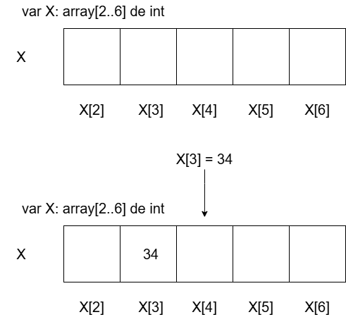
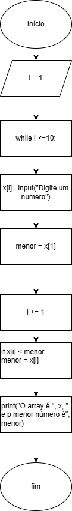

# UNICSUL | Técnicas de Desenvolvimento de Algoritmos | Módulo VI: Vetores e Matrizes

🎯Objetivo do módulo: desenvolver algoritmos com pseudocódigos usando vetores e matrizes.

Vetores e Matrizes são tipos de dados.

## Vetor (array)

Conhecido como variável composta homogênea unidimensional. 

Um array é como uma sequência de caixas iguais disponibilizadas para armazenar variáveis do mesmo tipo.

Tradução: São um conjunto de variáveis do mesmo tipo, referenciadas pelo mesmo identificador (o nome da variável) e são alocadas (disponibilizadas) sequencialmente na memória. Por isso, o que as distinguem são seus índices que referenciam suas localizações.

Em pseudocódigo:

   var nome da variável: vetor\[posição inicial..posição final] de tipo\_de\_dados

Para atribuir valores a cada "caixa" dentro do array, é preciso colocar o nome da variável e informar seu indíce (seu endereço dentro do array)

X[2]

### Utilizando vetor em estruturas de código

Array em loop

   Algoritmo "semnome"

   // Disciplina   : \[Vetores e Matrizes]

   // Descrição   : Aqui você descreve o que o programa faz! (função)

   // Autor(a)    : Danielli Ayumi Obayashi

   // Data atual  : 03/11/2025

   Var

   // Seção de Declarações das variáveis 

   i: inteiro

   x: vetor\[1..5] de real

   Inicio

   // Seção de Comandos, procedimento, funções, operadores, etc... 

   para i <- 1 até 5 faça

   escreval("Digite o", i, "° número")

   leia(x[i])

   fimpara

   Fimalgoritmo

Para mostrar itens colocados no array:

   para i<-1 até 5 faça

       escreval("Conteúdo de posição", i)

       escreval(x\[i])

   fimpara

Variável de controle: é uma variável numérica que controla o número de vezes que um loop é repetido

## Praticando vetores

Montar fluxogramas e pseudocódigos dos seguintes enunciados:

- O algoritmo deve receber dez números digitados pelo usuário e mostrar qual o menor.

## Matrizes

Uma matriz é uma variável composta homogênea multidimensional. Esse tipo de estrutura organiza os dados em tabelas e possuem dois indíces que representam linhas e colunas.

exemplo de declaração de variável de mat:

var mat:vetor [1..2, 1..4] de inteiro

Usando loop para atribuir valores a cada "quadradinho" da matriz

Pseudocódigo:

   \\\\ i é o indíce das linhas (i) e j são as colunas (i,j)

   Algoritmo "UsandoMatriz"

   var

   x: vetor\[1..2, 1..4] de real

   i,j: inteiro

   Inicio

   para i <- 1 até 2 faça

    para j <-1 até 4 faça

    escreval("Para X\[",i,",",j,"] =")

    leia(x\[i,j])

    para i <- 2 até 2 faça

         para j <-1 até 4 faça

         escreval("Para X\[",i,",",j,"] =")

         leia(x\[i,j])

    

       fimpara

   fimpara

   fimalgoritmo

Exemplo 1: O algoritmo deve receber 6 números digitados pelo usuário, armazenando-os em uma matriz 3 X 2. Em

seguida, deve mostrar qual o maior número digitado

  

   Algoritmo "TreinoMatriz"

       var

       x: vetor\[1..3,1..2] de real

       i,j :inteiro

       maior: real

   Inicio

   para i <- 1 até 3 faça

       para j <-1 até 2 faça

       Escreval("Para x[" , i, ",", j, "]: ")

       Leia(x[i,j])

       maior <- x\[1,1]

       se x[i,j] > maior entao

       maior <- x\[i,j]

       Fimse

       Fimpara

   Fimpara

   Escreval("O maior número é", maior)

   fimalgoritmo

## Prova UNICSUL:

Questão 1:

Considerando a declaração do vetor a seguir, qual, dentre as seguintes alternativas, permite carregar esse vetor com o seu índice multiplicado por 10

var vet: vetor[1..5] de inteiro

Minha resposta: 

   i: inteiro

   para i de 1 até 5 passo 1 faça

       vet[i] <- i * 10

 

   fimpara

   fimalgoritmo

Questão 2:

Um vetor é conhecido como uma estrutura composta unidimensional homogênea. Qual, dentre as seguintes alternativas, permite carregar um vetor de 10 posições, com dados digitados pelo usuário, de trás para frente?

&nbsp;   Algoritmo "Questao2"

&nbsp;   var vet: vetor\[1..10] de inteiro

&nbsp;   Inicio

&nbsp;       para i de 1 até 10 passo -1 faça

&nbsp;       leia(vet\[i])

&nbsp;       fimpara

&nbsp;   fimalgoritmo

Questão 3:

Um algoritmo é uma sequência de passos os quais visam atingir um objetivo. Nesse caso, com o trecho do algoritmo a seguir, qual é o objetivo que se pretende alcançar?

&nbsp;   para i de 1 ate 10 passo 2 faça 

&nbsp;       leia(vet\[i])

&nbsp;       vet\[i+1] <- vet\[i]+1

&nbsp;   fimpara

Minha respostas: 

O usuário define quais valores serão inseridos no vetor vet\[1]. O próximo vetor será vet\[3], que irá definir o vetor vet\[4] cujo valor será vet\[3] (inserido pelo usuário) + 1

Exemplo-teste:

&nbsp;   vet\[1]= 3

&nbsp;   vet\[1+1] <- 4

Questão 4:

Uma matriz é conhecida como uma estrutura composta bidimensional homogênea. Considerando a declaração da matriz a seguir, assinale a alternativa que permite carregar essa matriz com a soma dos seus índices.

var m:vetor\[1..3, 2..4] de inteiro

i, j: inteiro

para i de 1 até 3 faça

&nbsp;   para j de 2 até 4 passo 1 faça

&nbsp;   m\[i,j] <- i+j

Questão 5:

Uma matriz é uma estrutura homogênea multidimensional em que seus elementos são diferenciados pelos seus índices. Em uma matriz, a diagonal principal é dada pelas posições em que a linha é igual a coluna. Qual, dentre as seguintes alternativas, carrega uma matriz 3 x 3 com valor 0 na diagonal principal e valor 1 nas demais posições?

!\[Questão 5 Desenho](questao5\_prova\_unicsul.png)

var m: vetor\[1..3, 1..3] de real 

&nbsp;   i,j: inteiro

&nbsp;   

&nbsp;   inicio

&nbsp;   para i de 1 até 3 faça

&nbsp;       para j de 1 até 3 faça

&nbsp;       se i <- j entao

&nbsp;       m\[i,j] <- 0

&nbsp;       senao

&nbsp;       m\[i,j] <-1 

&nbsp;       Fimse

&nbsp;       Fimpara

&nbsp;   fimpara

fimalgoritmo

